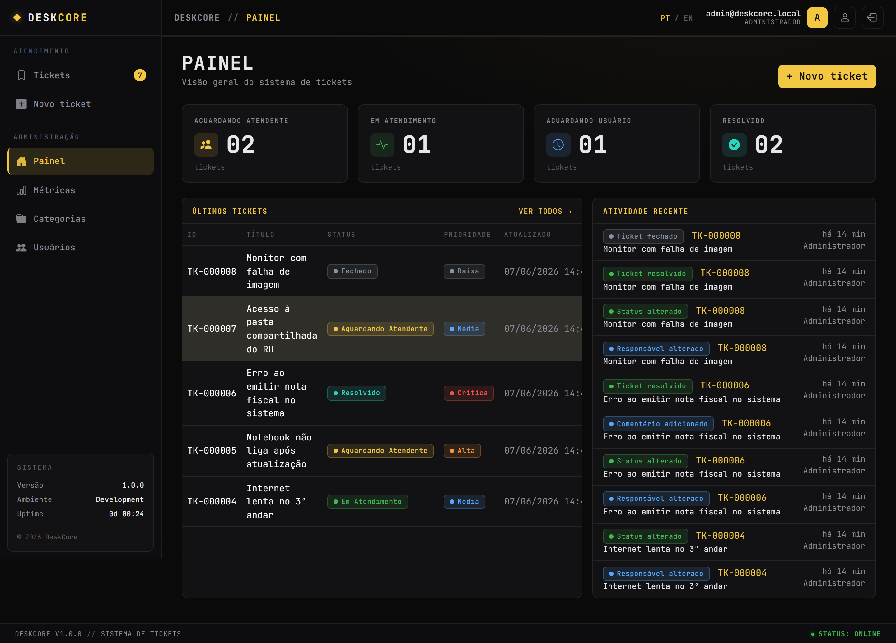
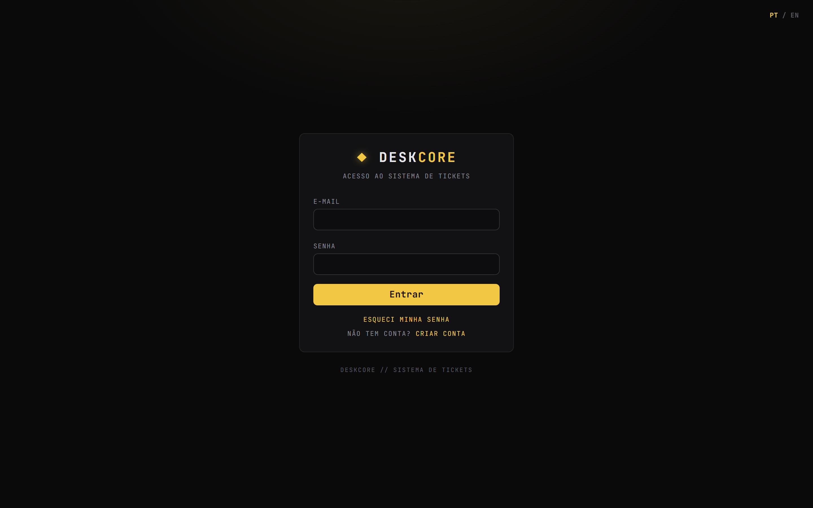
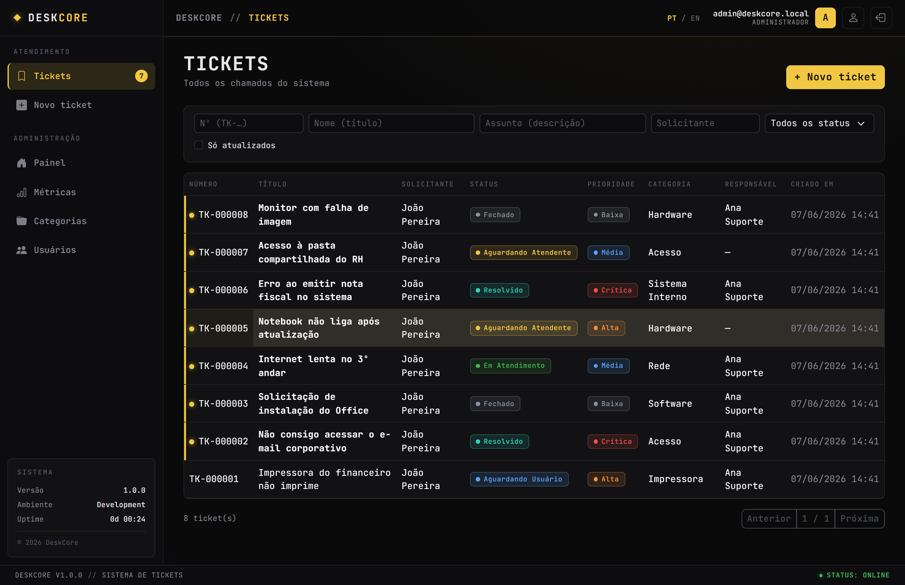
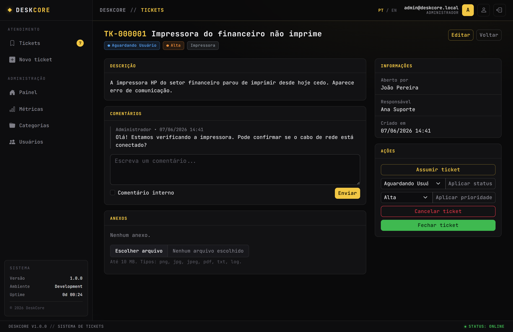
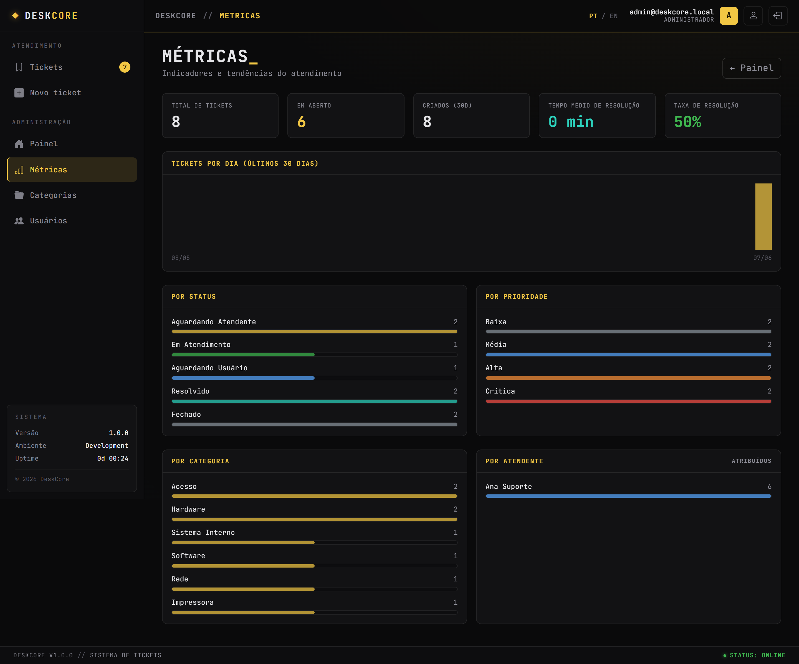
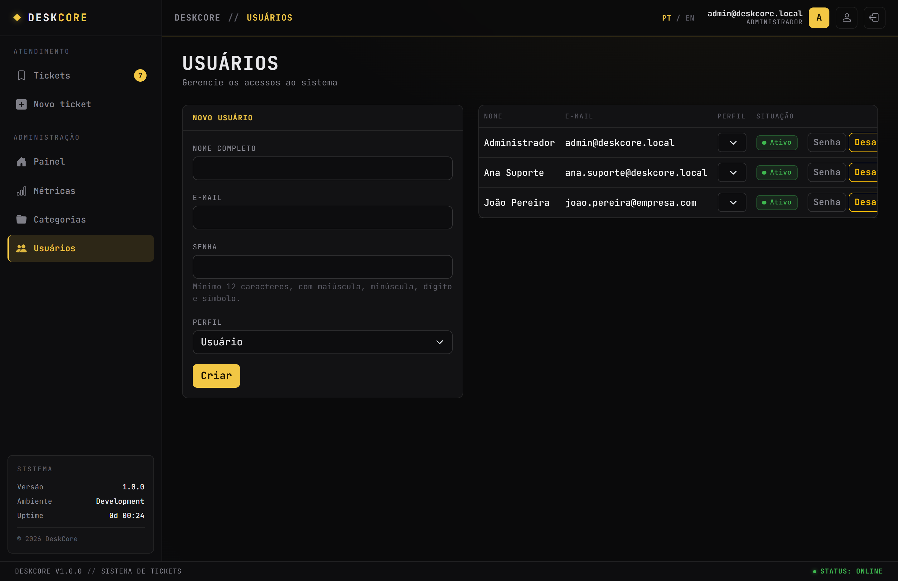

# DeskCore

Sistema Web de **tickets e atendimento** para empresas, com implantação dedicada por cliente (modelo *single-tenant* por instância). Cada empresa roda sua própria instância isolada — Web, API, banco PostgreSQL e arquivos próprios, sem multiempresa no mesmo banco.

> **Status:** Estável / pronto para produção. Além do núcleo (backend, frontend, Docker/Nginx/HTTPS), inclui auto-cadastro com confirmação por e-mail e anti-bot, notificações de novidade, feed de atividade, edição de tickets, upload com barra de progresso, **base de conformidade LGPD**, **endurecimento de segurança** e **interface bilíngue PT-BR / English**. Suíte com **145 testes**.
>
> 🔧 **Antes de publicar/implantar a sua instância**, personalize a marca e os dados do controlador — veja [Personalização & marca](#personalização--marca).



## Índice

- [Telas](#-telas)

- [Stack](#stack)
- [Arquitetura](#arquitetura)
- [Funcionalidades (V1)](#funcionalidades-v1)
- [Rodar com Docker (produção/staging)](#rodar-com-docker-produçãostaging)
- [Configuração (`.env`)](#configuração-env)
- [Acessar o sistema](#acessar-o-sistema)
- [O primeiro Admin](#o-primeiro-admin)
- [Uploads / anexos](#uploads--anexos)
- [Segurança](#segurança)
- [Rodar localmente (desenvolvimento)](#rodar-localmente-desenvolvimento)
- [Migrations](#migrations)
- [Testes](#testes)
- [Roadmap](#roadmap)

## 📸 Telas

Tema escuro "terminal" com acento dourado, bilíngue PT-BR / English.

<table>
  <tr>
    <td width="50%"><b>Login</b><br/></td>
    <td width="50%"><b>Lista de tickets</b> (filtros, status, prioridade)<br/></td>
  </tr>
  <tr>
    <td width="50%"><b>Detalhe do ticket</b> (comentários, anexos, ações)<br/></td>
    <td width="50%"><b>Métricas</b> (KPIs e gráficos)<br/></td>
  </tr>
  <tr>
    <td width="50%"><b>Administração de usuários</b><br/></td>
    <td width="50%"></td>
  </tr>
</table>

> As capturas usam dados de demonstração gerados por `tools/seed_demo.py` (uso local).

## Stack

| Camada | Tecnologia |
|--------|-----------|
| Frontend | Blazor Web App (.NET 10, render mode Server) |
| Backend | ASP.NET Core Web API (Controllers) |
| ORM / Banco | Entity Framework Core + PostgreSQL 16 |
| Autenticação | ASP.NET Identity (cookie); Web consome a API via BFF |
| Deploy | Docker + Docker Compose + Nginx (TLS/HTTPS) |
| Testes | xUnit + Shouldly + Testcontainers + WebApplicationFactory |

## Arquitetura

Solução em camadas (`.slnx`), seguindo separação de responsabilidades:

```
src/
  DeskCore.Domain          # Entidades, enums, regras puras, constantes (zero deps de infra)
  DeskCore.Application      # Services/casos de uso, abstrações, validações de fluxo (Result<T>)
  DeskCore.Infrastructure   # EF Core + Npgsql, Identity, migrations, FileStorage, seed
  DeskCore.Api             # Controllers REST, auth cookie, policies, rate limit, security headers
  DeskCore.Web             # Blazor Web App (Server), telas, consumo da API (BFF)
  DeskCore.Shared          # Requests/Responses/DTOs e enums compartilhados
tests/
  DeskCore.Domain.Tests        # Tier 1 — regras de domínio (puro, sem Docker)
  DeskCore.Application.Tests    # Tier 2 — services com PostgreSQL real (Testcontainers)
  DeskCore.Api.Tests           # Tier 3 — pipeline HTTP (WebApplicationFactory + Testcontainers)
```

### Topologia em produção

```
Browser ──(cookie, mesma origem)──► NGINX (TLS/HTTPS)
                                       ├── /        → DeskCore.Web (Blazor Server)
                                       └── /api/*   → DeskCore.Api
                                                        └── PostgreSQL + volume de uploads
```

A Web nunca fala com o banco: ela autentica via BFF e consome a API por HTTP interno na rede do
compose. O Nginx termina o TLS e encaminha `X-Forwarded-*` (a API/Web confiam na sub-rede interna
via `ForwardedHeaders`).

## Funcionalidades

### Núcleo (V1)
- **Tickets**: criação, listagem com filtros e paginação, detalhe, **edição de título/descrição**, atribuição, mudança de status/prioridade, fechamento e cancelamento.
- **Máquina de estados**: `WaitingAgent → InProgress → WaitingUser → Resolved → Closed` (+ `Canceled`), com transições validadas no domínio.
- **Comentários**: públicos e internos (internos visíveis apenas para Atendente/Admin).
- **Anexos**: upload seguro (validação de extensão, Content-Type e tamanho; nome interno; SHA-256; download autenticado) com **seleção explícita, barra de progresso e feedback de sucesso/erro**.
- **Categorias**: administráveis, com ativação/desativação (sem exclusão física).
- **Usuários e perfis**: roles `User` / `Agent` / `Admin`; criação e gestão pelo Admin; navegação e telas por papel.
- **Auditoria**: trilha de ações nos tickets e log de tentativas de login (com IP e user-agent).

### Acesso e atendimento
- **Auto-cadastro de cliente**: registro público com **confirmação por e-mail** (conta inativa até confirmar), **anti-bot Cloudflare Turnstile** e e-mail único. E-mail transacional via **Resend** (SMTP).
- **Notificações de novidade**: marcador na lista de tickets e contagem no menu quando há atividade nova (resposta, status, anexo) desde a última visita; filtro "só atualizados".
- **Painel**: visão geral por status, últimos tickets e **feed de Atividade Recente** (auditoria global) — área de atendimento/admin.

### Privacidade (LGPD) e idioma
- **Conformidade LGPD**: Política de Privacidade, consentimento no cadastro, e **direitos do titular** (exportar dados em JSON, corrigir o nome, e excluir a conta por anonimização) em **Minha conta**; expurgo automático de logs após 12 meses; aviso de cookies.
- **Bilíngue PT-BR / English**: seletor de idioma em todas as telas (inclusive pré-login); textos, mensagens do servidor, validações, e-mail de confirmação e política nos dois idiomas.

## Rodar com Docker (produção/staging)

Pré-requisitos: **Docker** e **Docker Compose**.

```bash
# 1. Configurar variáveis de ambiente (ver seção abaixo)
cp .env.example .env
# edite o .env com senhas fortes e o e-mail do admin inicial

# 2. Certificados TLS em docker/nginx/certs/
#    - Produção: fullchain.pem + privkey.pem (ex.: Let's Encrypt)
#    - Dev/teste local: gere certificados self-signed
#      pwsh docker/nginx/generate-dev-certs.ps1

# 3. Subir o stack completo (postgres + api + web + nginx)
docker compose -f docker-compose.yml up -d --build

# 4. Acompanhar o startup (migrate + seed acontecem no boot da API)
docker compose logs -f deskcore-api
```

O `docker-compose.yml` sobe quatro serviços (`deskcore-postgres`, `deskcore-api`, `deskcore-web`,
`deskcore-nginx`) numa rede dedicada com sub-rede fixa `172.28.0.0/16`, healthcheck no Postgres e
volumes persistentes (`postgres_data`, `uploads_data`, `logs_data`, `dataprotection_keys`).

> **Nota:** em desenvolvimento, o `docker-compose.override.yml` é aplicado automaticamente por
> `docker compose up` e expõe o Postgres na porta `5433`. Em produção, suba **apenas o base** com
> `-f docker-compose.yml` (sem o override).

### Let's Encrypt (produção)

Aponte o DNS (registro A) do seu domínio para o IP do servidor, emita o certificado e coloque
`fullchain.pem` / `privkey.pem` em `docker/nginx/certs/` (ou faça symlink para
`/etc/letsencrypt/live/<domínio>/`). O Nginx já serve `/.well-known/acme-challenge/` via volume
`certbot_www` para a validação.

## Configuração (`.env`)

Variáveis sensíveis ficam **fora do repositório** — copie `.env.example` para `.env` e ajuste.
Nunca versione o `.env` real.

| Variável | Descrição |
|----------|-----------|
| `POSTGRES_DB` / `POSTGRES_USER` / `POSTGRES_PASSWORD` | Banco PostgreSQL |
| `SEED_ADMIN_EMAIL` / `SEED_ADMIN_PASSWORD` / `SEED_ADMIN_FULLNAME` | Admin inicial (criado apenas se ainda não houver nenhum Admin) |
| `ASPNETCORE_ENVIRONMENT` | `Production` em produção |
| `APP_PUBLIC_URL` | URL pública (domínio) da instância — usada no link de confirmação de cadastro |
| `Email__Smtp__*` (`Host`/`Port`/`User`/`Password`/`From`/`FromName`) | SMTP para o e-mail de confirmação do auto-cadastro. Sem `Host`/`From`, o envio é desativado e o cadastro fica só local. Configurado para **Resend** (`smtp.resend.com:587`). |
| `Turnstile__SiteKey` / `Turnstile__SecretKey` | Anti-bot Cloudflare Turnstile no cadastro. Sem `SecretKey`, a verificação é pulada (e o widget não aparece). |

Variáveis injetadas pelo compose nos containers (não precisam estar no `.env`): a connection string
da API (`ConnectionStrings__DefaultConnection`), `FileStorage__RootPath` (`/app/uploads`),
`DataProtection__KeysPath` (`/app/keys`), `ApiSettings__BaseUrl` (`http://deskcore-api:8080`) e
`ForwardedHeaders__KnownNetworks__0` (sub-rede interna).

## Acessar o sistema

Após o stack subir e o DNS/cert estarem prontos, acesse **`https://<seu-domínio>`** (ou
`https://localhost` em teste local com cert self-signed). Faça login com o e-mail e a senha do
admin inicial definidos no `.env` (`SEED_ADMIN_EMAIL` / `SEED_ADMIN_PASSWORD`).

Em desenvolvimento (sem Docker) o sistema fica em **`https://localhost:5444`** — ver
[Rodar localmente](#rodar-localmente-desenvolvimento).

## O primeiro Admin

O Admin inicial é criado **no primeiro start da API**, a partir de `SEED_ADMIN_EMAIL` /
`SEED_ADMIN_PASSWORD` / `SEED_ADMIN_FULLNAME`. O seed é idempotente: **só cria** se ainda não
existir nenhum usuário com a role `Admin` (escopo §8). Definir/alterar essas variáveis **depois**
que um Admin já existe não tem efeito.

Para rotacionar o administrador depois do primeiro boot, faça login como Admin e use **Admin →
Usuários**: crie um novo usuário com role `Admin` e **desative** o antigo (a desativação invalida
as sessões existentes do usuário). Não há exclusão física de usuários.

## Uploads / anexos

A validação dos anexos é feita na camada de aplicação, de forma defensiva (escopo §14):

- **Extensões permitidas:** `.png`, `.jpg`, `.jpeg`, `.pdf`, `.txt`, `.log` (e há uma *blocklist*
  explícita de executáveis/scripts como `.exe`, `.bat`, `.ps1`, `.js`, `.html`, `.dll`, …).
- **Content-Type** deve casar com a extensão (ex.: `.png` ⇒ `image/png`).
- **Tamanho máximo:** 10 MB por arquivo; **máximo de 5 arquivos por ticket**.
- Cada arquivo é gravado **fora da pasta pública**, com **nome interno** próprio (não o nome
  enviado), **hash SHA-256** calculado no fluxo de escrita e proteção **anti path-traversal** na
  leitura/remoção.
- **Download** é apenas por rota autenticada, com a mesma checagem de acesso ao ticket (anti-IDOR);
  o nome original é só metadado de exibição.

Tickets em estado terminal (`Closed`/`Canceled`) não aceitam novos anexos.

## Privacidade (LGPD)

O sistema traz a base técnica de conformidade com a LGPD (o texto da Política deve ser revisado por
profissional jurídico):

- **Política de Privacidade** pública (`/privacidade`, PT/EN) e **consentimento** obrigatório no auto-cadastro (data e versão registradas).
- **Direitos do titular** em **Minha conta**: exportar os próprios dados (JSON), corrigir o nome e **excluir a conta por anonimização** (nome/e-mail viram "Usuário removido"; tickets são preservados como histórico).
- **Retenção**: serviço diário que remove logs de login com mais de 12 meses e anonimiza IP/User-Agent das auditorias antigas.
- **Cookies**: apenas essenciais (autenticação/sessão), com aviso informativo.

## Segurança

- HTTPS obrigatório em produção (**renovação automática do certificado Let's Encrypt** via webroot + cron); senha forte e bloqueio por tentativas (lockout) no Identity.
- Autorização por role e por endpoint; **proteção anti-IDOR** (todo acesso a ticket/anexo valida permissão).
- Validação forte de uploads e download apenas por rota autenticada (servido como anexo, sem render inline).
- Proteção contra SQL Injection (EF Core + queries parametrizadas) e XSS (sem renderização de HTML bruto).
- Rate limiting, **security headers + CSP na API e no app Web** e captura de IP real atrás do proxy (ForwardedHeaders).
- Anti-bot (Cloudflare Turnstile) no auto-cadastro; confirmação de e-mail antes de ativar a conta.
- Configurações sensíveis fora do repositório (`.env`).

## Rodar localmente (desenvolvimento)

Pré-requisitos: **.NET 10 SDK** e **Docker**.

```powershell
# 1. PostgreSQL (porta 5433 — a 5432 local costuma estar ocupada)
docker run -d --name deskcore-pg `
  -e POSTGRES_PASSWORD=postgres -e POSTGRES_USER=postgres -e POSTGRES_DB=deskcore `
  -p 5433:5432 postgres:16

# 2. API (aplica migrations e faz o seed inicial no startup)
$env:ASPNETCORE_ENVIRONMENT="Development"
dotnet run --project src/DeskCore.Api --urls "https://localhost:5443"

# 3. Web (em outro terminal)
$env:ASPNETCORE_ENVIRONMENT="Development"
dotnet run --project src/DeskCore.Web --urls "https://localhost:5444"
```

Acesse **https://localhost:5444**. Usuário admin inicial (dev): `admin@deskcore.local` / `ChangeMe@123456`
(configurável em `src/DeskCore.Api/appsettings.Development.json`).

## Migrations

A ferramenta `dotnet-ef` está fixada no manifesto local (`.config/dotnet-tools.json`):

```powershell
dotnet tool restore
dotnet tool run dotnet-ef migrations add <Nome> --project src/DeskCore.Infrastructure
```

No startup da API as migrations são aplicadas automaticamente (single-tenant).

## Testes

Suíte em três camadas (**145 testes**). Os Tiers 2 e 3 usam **Testcontainers** e exigem **Docker
Desktop em execução** (sobem um PostgreSQL real descartável por execução).

```powershell
# Toda a suíte
dotnet test DeskCore.slnx

# Só o Tier 1 (domínio puro, não precisa de Docker)
dotnet test tests/DeskCore.Domain.Tests
```

| Projeto | Foco | Docker? |
|---------|------|---------|
| `DeskCore.Domain.Tests` | Máquina de estados, número do ticket, regras de upload | não |
| `DeskCore.Application.Tests` | Services com PostgreSQL real: IDOR/permissão, comentário interno, upload, número sob concorrência | sim |
| `DeskCore.Api.Tests` | Pipeline HTTP: auth por cookie, 401/403, IDOR, upload multipart, rate limit | sim |

## Roadmap

- [x] Fundação da solução e camadas
- [x] Domínio (entidades, enums, máquina de estados)
- [x] Infraestrutura (EF Core, Identity, storage, seed)
- [x] Aplicação (services, validações, permissões)
- [x] API REST (controllers, segurança, rate limit)
- [x] Web (Blazor Server, BFF, telas)
- [x] Docker + Docker Compose + Nginx + HTTPS
- [x] Testes (xUnit + Testcontainers + WebApplicationFactory)
- [x] Documentação

### Pós-V1 (em produção)
- [x] Navegação/telas por papel, filtros de tickets e responsivo
- [x] Auto-cadastro com confirmação por e-mail (Resend) + anti-bot (Turnstile)
- [x] Edição de título/descrição do ticket
- [x] Upload de anexos com seleção explícita, progresso e feedback
- [x] Feed de atividade recente no Painel
- [x] Notificações de novidade (marcador + contagem, por papel)
- [x] Conformidade LGPD (política, consentimento, exportar/anonimizar, retenção, cookies)
- [x] Endurecimento de segurança (headers/CSP no Web, renovação automática do cert TLS)
- [x] Internacionalização PT-BR / English (100%, inclusive mensagens do servidor)

## Personalização & marca

Este repositório é um **template open source**. Antes de publicar a sua instância, ajuste:

- **Dados do controlador (LGPD)** — a Política de Privacidade em `src/DeskCore.Web/Program.cs`
  traz placeholders `[Nome do Controlador]` / `[Nome do Encarregado]` / `contato@exemplo.com`.
  **Revise o texto com um profissional jurídico.**
- **Marca / rodapé** — `EmptyLayout.razor`, `MainLayout.razor`, `NavMenu.razor` e o rodapé de
  `Program.cs` usam "DESKCORE". Troque pelo nome da sua organização se quiser.
- **Meta tags / preview social** — `src/DeskCore.Web/Components/App.razor` usa o domínio
  placeholder `https://your-domain.example`. Aponte para o seu domínio e troque `og-image.png`.
- **Domínio** — defina `APP_PUBLIC_URL` no `.env`; o Nginx já usa `server_name _;` (genérico).

## Segurança

Encontrou uma vulnerabilidade? Veja [`SECURITY.md`](SECURITY.md) — **não** abra issue pública.

## Licença

Distribuído sob a licença **MIT**. Veja [`LICENSE`](LICENSE).
